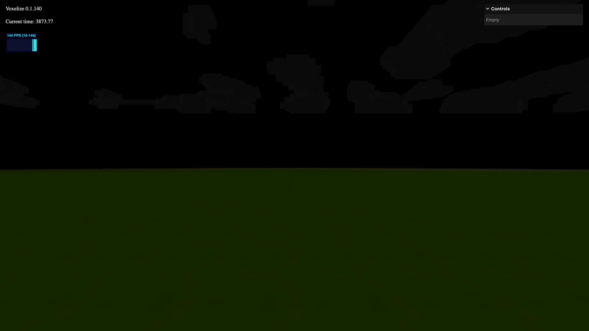

# Debug Voxelize

It is fairly easy to use the built-in voxelize debug UI. All you have to do is:

```javascript title="main.js"
import '@voxelize/core/dist/styles.css'; // For any built-in UI in Voxelize

// ...

const debug = new VOXELIZE.Debug(document.body);

debug.registerDisplay('Current time', world, 'time', (time) => time.toFixed(2));

inputs.bind('j', debug.toggle)

// ...

function animate() {
    // ...

    if (world.isInitialized) {
        // ...

        debug.update();
    }
}

// ...
```

I added a debugging element called "Current time", which reads the `time` property from the world every time `debug.update()` is called. The last argument passed in is the **formatter**, which formats the time to 2 decimal places.

Additional to the built-in debug element, I also recommend using the `lil-gui` library to quickly create interactive debugging elements:

```bash
npm install lil-gui
```

```javascript title="main.js"
import { GUI } from 'lil-gui';

const gui = new GUI();
gui.domElement.style.top = "10px";
```

You should see these two panels once everything is working.

