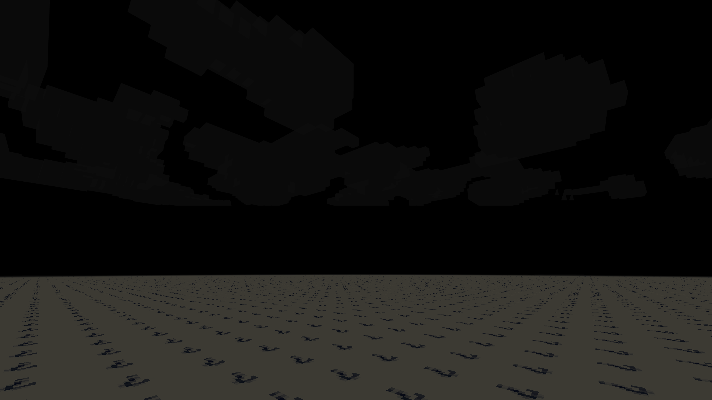

# Player Control

Since Voxelize is built with ThreeJS, any camera controller would theoretically work perfectly. Voxelize does provide developers a well-rounded physics-based controller to walk run and jump around the voxel world, which is the `VOXELIZE.RigidControls`. `RigidControls` actually uses the ThreeJS PointerLockControls internally.

```javascript title="main.js"
const inputs = new VOXELIZE.Inputs();

const rigidControls = new VOXELIZE.RigidControls(
    camera,
    renderer.domElement,
    world,
    {
        initialPosition: [0, 40, 0],
    },
);
rigidControls.connect(inputs); // Register the keybindings

// ...

function animate() {
    // ...

    if (world.isInitialized) {
        // ...
        rigidControls.update();
    }
}
```

With this, you can now navigate around the voxelize world and should see something as below:



All the blocks below are currently still question marks, this is the default texture in Voxelize. We will add texture in the next chapter!

## Add Flight Controls

Let's quickly add the ability to toggle fly or ghost mode with `f` or `g` key presses.

```javascript title="main.js"
inputs.bind('g', rigidControls.toggleGhostMode);
inputs.bind('f', rigidControls.toggleFly);
```

`input.bind` binds the key press to a given function, which in this case is `rigidControls.toggleGhostMode` and `rigidControls.toggleFly`. Now, try flying out and around. The world should generate the chunks around you on the spot!