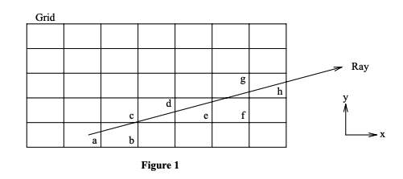
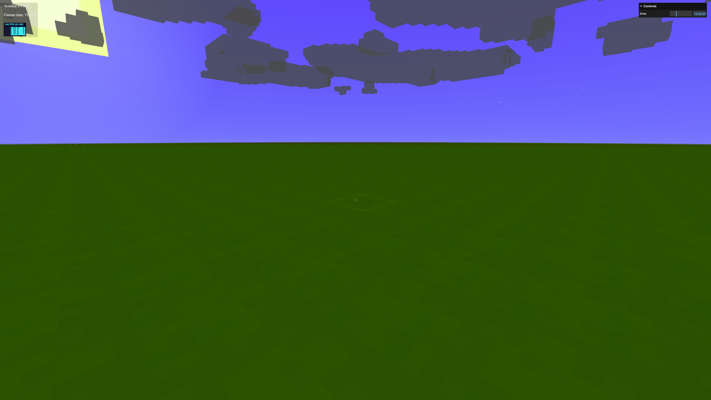
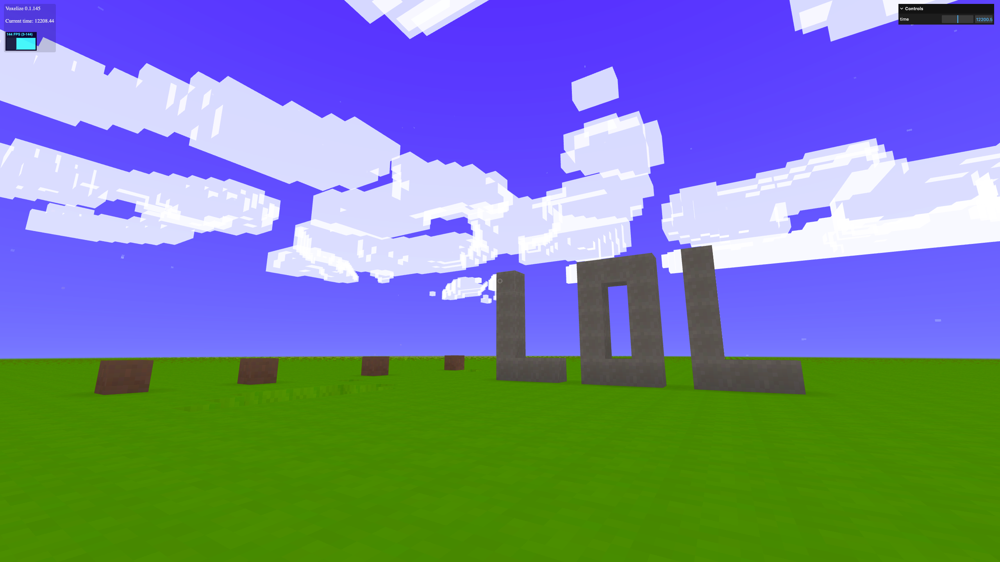

# Update Voxels

In order to update voxels, we need to cast a ray from the camera to the voxel world and figure out which voxel the player is looking at. Luckily, there is a very fast algorithm to do so [here](http://www.cse.yorku.ca/~amana/research/grid.pdf).



With this method, we can quickly calculate which voxel we're looking at, and update the voxel type based on our mouse input. For example, left click to break, right click to place. Voxelize has this voxel algorithm built-in in the `VOXELIZE.VoxelInteract` class.

```javascript title="main.js"
const voxelInteract = new VOXELIZE.VoxelInteract(camera, world, {
    highlightType: 'outline',
});
world.add(voxelInteract); // Add the highlighting mesh to the scene

// ...

function animate() {
    if (world.isInitialized) {
        voxelInteract.update();
    }
}
```

```html title="index.html"
<div id="app">
    <canvas id="canvas"></canvas>
    <div id="crosshair" />
</div>
```

```css title="style.css"
#crosshair {
  width: 12px;
  height: 12px;
  border: 2px solid #fff3;
  border-radius: 6px;
  position: fixed;
  top: 50%;
  left: 50%;
  transform: translate(-50%, -50%);
}
```



With this, you should be able to see a white outline to wherever we're looking at with a semi-transparent crosshair in the middle.

## Break on Right Click

It is really easy too to implement block breaking. We can use the `VOXELIZE.Inputs` that we created earlier to do so.

```javascript title="main.js"
inputs.click('left', () => {
    if (!voxelInteract.target) return;

    const [x, y, z] = voxelInteract.target;
    world.updateVoxel(x, y, z, 0);
});
```

As you can see, `world.updateVoxel` is what we need to make server changes. What happens internally is that the world adds a `UPDATE` type packet to it's `packets` array, and it gets sent to the server. The server handles the chunk updates, and sends back the new chunk information back.

## Place the Blocks

To place the blocks, we can use the [`voxelInteract.potential`](/api/client/classes/VoxelInteract#potential), which is calculated using the target position and the normal of the face hit. 

```javascript title="main.js"
let holdingBlockType = 1; // Hold dirt by default

inputs.click('middle', () => {
    if (!voxelInteract.target) return;

    const [x, y, z] = voxelInteract.target;
    holdingBlockType = world.getVoxelAt(x, y, z);
});

inputs.click('right', () => {
    if (!voxelInteract.potential) return;

    const { voxel } = voxelInteract.potential;
    world.updateVoxel(...voxel, holdingBlockType);
});
```



Just like that, you can now left click to break, middle click to obtain block, and right click to place!