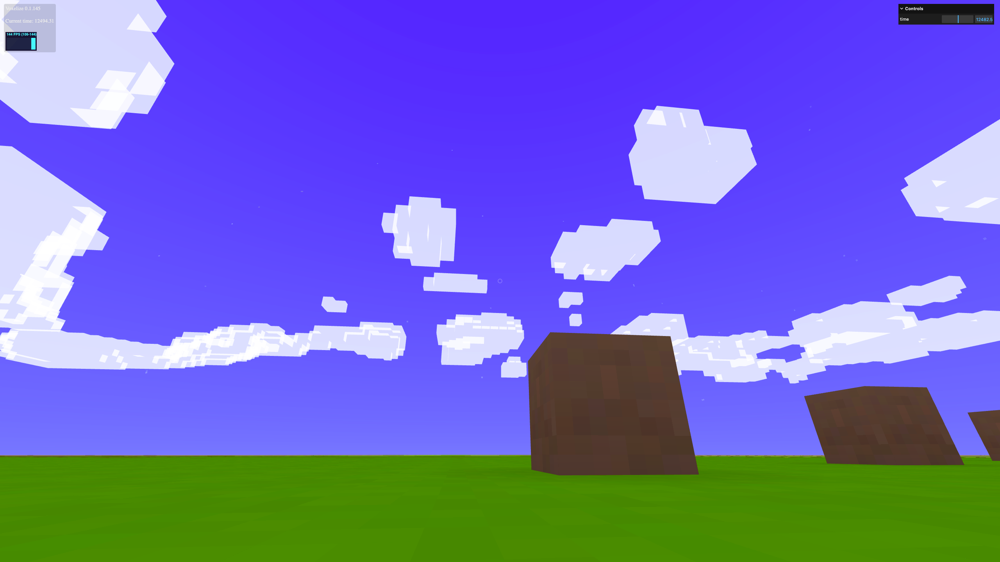
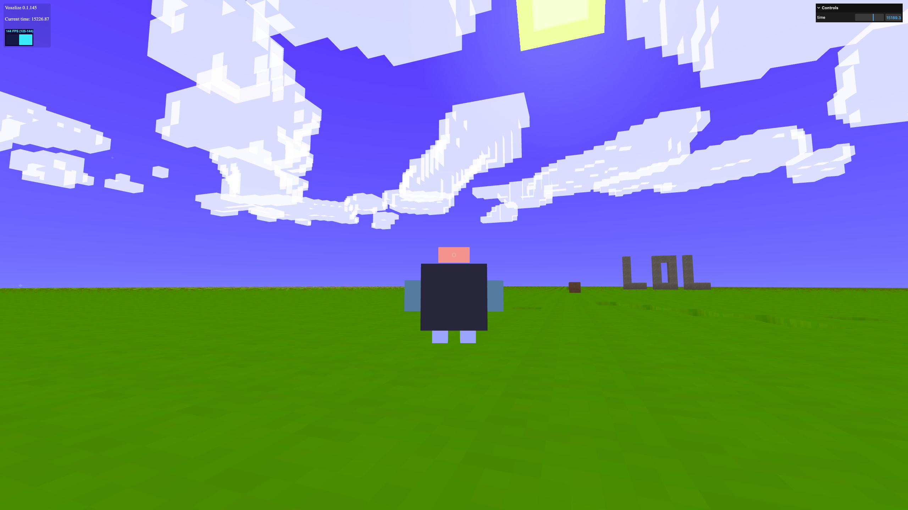
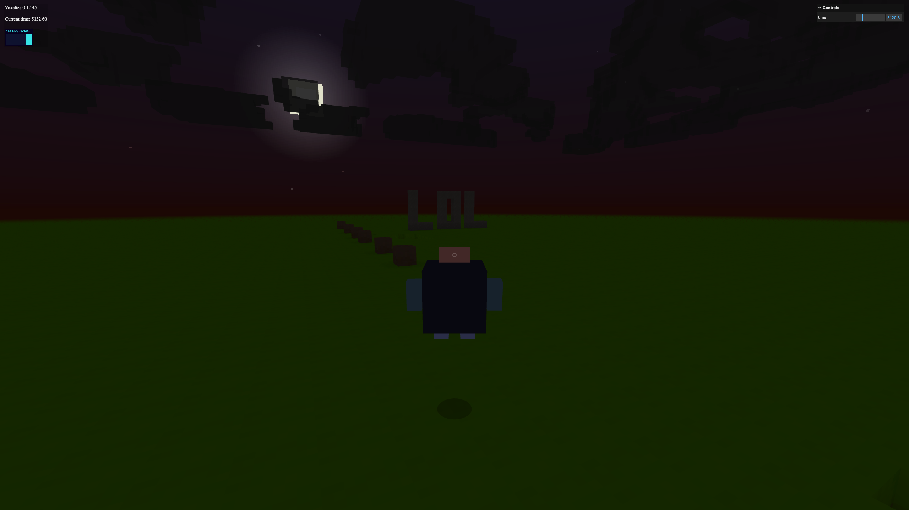

# Set Perspectives

Me personally, I really like to play games in 3rd person's perspective. So, let's quickly add perspective switching to our app by pressing "c". 

```javascript title="main.js"
const perspectives = new VOXELIZE.Perspective(rigidControls, world);
perspectives.connect(inputs); // Binds "c" by default

function animate() {
    if (world.isInitialized) {
        perspectives.update();
    }
}
```

However, you'll realize when you press "c", it seems like the camera's perspectives changed. Yet, there doesn't seem to be anything to look at. The example below shows a 2nd person perspective with nothing to look at.



To solve this, let's add a Voxelize character to our `rigidControls`.

## Add a Voxelize Character

We're going to create a utility function to create our characters. This is useful because later on when we add multiplayer, we can reuse this function.

```javascript title="main.js"
function createCharacter() {
    const character = new VOXELIZE.Character();
    world.add(character);
    return character;
}

const mainCharacter = createCharacter();
rigidControls.attachCharacter(mainCharacter);
```

Just like that, we have our main character in place.



## Shadows and Light Shined

Voxelize comes with an option to create shadows as well. A shadow is just a darken-transparent circle that is placed below a given object in the scene. The shadow is automatically updated to stick on the ground, and changes size with how far the object is from the ground.

Also, `VOXELIZE.LightShined` is a ulitity to recursively update an object's light level based on the voxel lighting around it. Otherwise, since Voxelize uses `MeshBasicMaterial` for most of its things, it would appear to be bright even at night time. 

```javascript title="main.js"
const shadows = new VOXELIZE.Shadows(world);
const lightShined = new VOXELIZE.LightShined(world);

function createCharacter() {
    const character = new VOXELIZE.Character();
    world.add(character);
    // highlight-start
    lightShined.add(character);
    shadows.add(character);
    // highlight-end
    return character;
}

// ...

function animate() {
    if (world.isInitialized) {
        // ...
        lightShined.update();
        shadows.update();
        // ...
    }
}
```



Notice how the character is dimmed, and there appears to be a shadow below. 