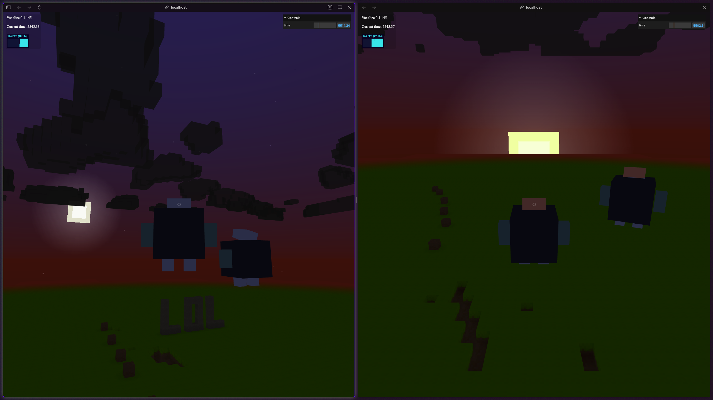

# Multiplayer

Voxelize uses websockets under the hood, and multiplayer functionality is actually already built into the engine. You can implement the client-side multiplayer by simply using `VOXELIZE.Peers`.
It is possible to customize and use your own mesh for other players' meshes. For this tutorial, we'll just use the Voxelize characters.

```javascript title="main.js"
const peers = new VOXELIZE.Peers(rigidControls.object);

peers.createPeers = createCharacter;

peers.onPeerUpdate = (peer, data) => {
    peer.set(data.position, data.direction);
};

world.add(peers);

// ...

function animate() {
    if (world.isInitialized) {
        // ...
        peers.update(); 
    }
}
```

Here, we pass in the rigidControls's object, which is just the camera. This is used to send back this client's current position every frame to update all the other clients. Also, the `peer.set` is using the [`Character.set`](/api/client/classes/Character#set), which updates the Voxelize characters.



That's it, now you have multiplayer!