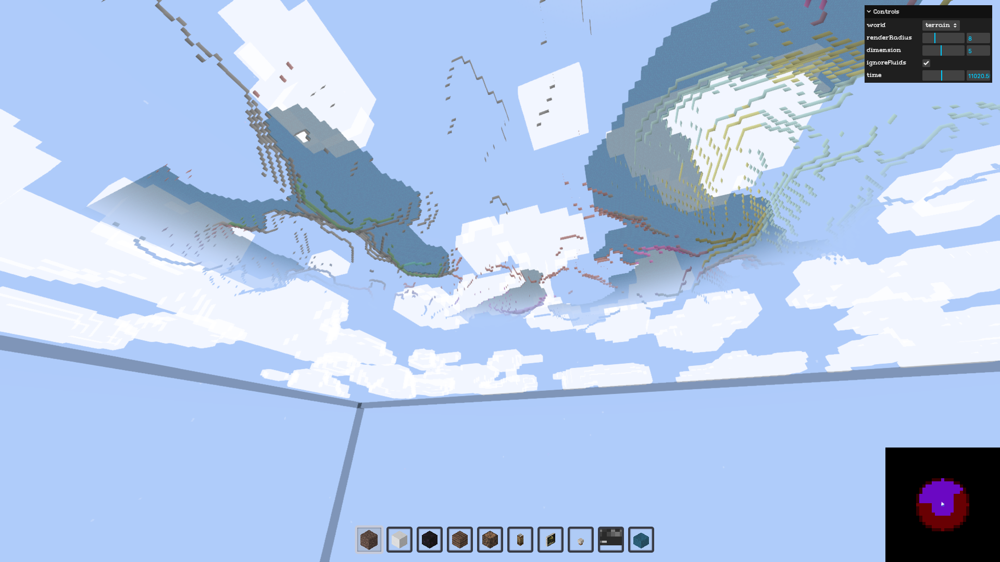

# Initialize the World

Upon connecting to the server, the voxelize world receives a `INIT` packet since it's registered onto the network. We need to use that packet and initialize the world so that `world.isInitialized` would be true.

```javascript title="main.js"
function animate() {
    // ...

    network.sync();

    if (world.isInitialized) {
        // Do in-game updates here
    }

    // ...

    network.flush();
}

async function start() {
    // ...
    await network.join('tutorial');

    await world.initialize(); // Process the `INIT` packet
}
```

The world initialization retrieves the server-side chunking options (such as chunk size, registry blocks, etc), loads in the chunk materials, sets up the render radius, and starts the client-side meshing workers. If everything goes correctly, you should see something like below, where only the clouds are rendered:


Now that we have chunk materials loaded and the world initialized, we are ready to **implement the player controller**.

:::info
Note that `network.sync` and `network.flush` are being called immediately within the animate function. This ensures that the `world` can receive the `INIT` packet to run `world.initialize()`.
:::

## Update the World

Once the world is initialized, we can now update the world in our game loop. This process requests and meshes the chunks.

```javascript title="main.js"
function animate() {
    // ...

    if (world.isInitialized) {
        world.update(
            camera.getWorldPosition(new THREE.Vector3()), 
            camera.getWorldDirection(new THREE.Vector3()),
        );
    }

    // ...
}
```

The first argument to `update` is the center position to request chunks from. For instance, say the player is at `(0, 0, 0)` and has a render radius of 8 chunks, the world would request all the chunks within 8 chunks from the origin. Here, we pass in the camera's position.

The second argument is for the direction of where the player is looking at. The world then uses it to frustum cull the chunks within the radius. This culls out the chunks that are "behind" the player, so we can prioritize on loading the chunks that can actually be seen.



As can be seen in the screenshot above, purple cells in the bottom right represents the chunks loaded, and red represents chunks within radius. The Voxelize world only loads in the chunks that the player is facing.