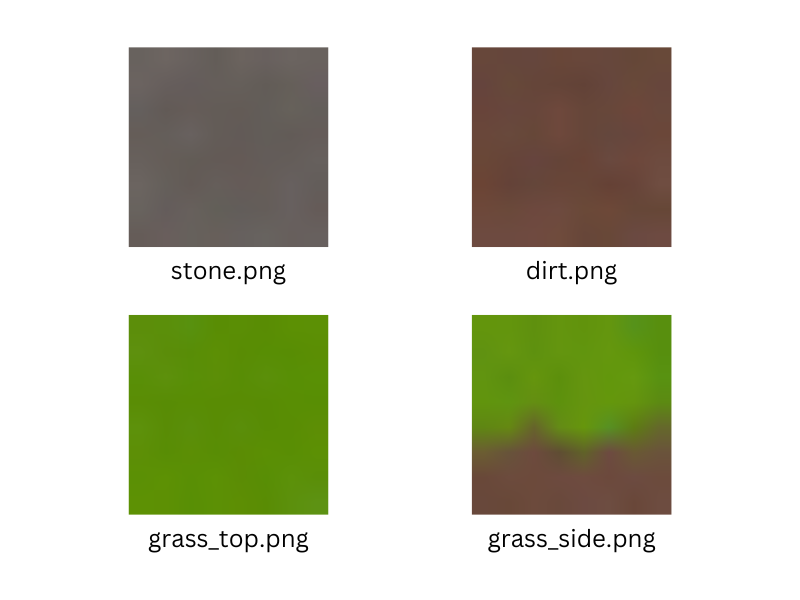
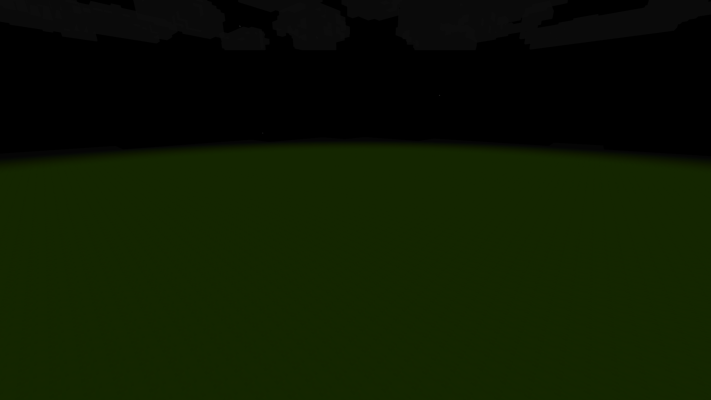

# Apply Textures

The next step that we will be taking is to apply textures to the blocks. Right now, the block textures are all question marks since we haven't applied any textures yet. We will be using the following four textures under `public/blocks`. The reason why `grass_side.png` is blurry is because it's actually only 8 pixels in dimension.



:::info
**IMPORTANT**: Initialize the world first, and then apply textures. This is because we are drawing onto the chunk's textures, which is initialized in `world.initialize`.
:::

```javascript title="main.js"
async function start() {
    // ...

    await world.initialize();
    
    // Apply block textures here
    const allFaces = ['px', 'nx', 'py', 'ny', 'pz', 'nz'];
    await world.applyBlockTexture('Dirt', allFaces, '/blocks/dirt.png');
    await world.applyBlockTexture('Stone', allFaces, '/blocks/stone.png');
    await world.applyBlockTexture('Grass Block', ['px', 'pz', 'nx', 'nz'], '/blocks/grass_side.png');
    await world.applyBlockTexture('Grass Block', 'py', '/blocks/grass_top.png');
    await world.applyBlockTexture('Grass Block', 'ny', '/blocks/dirt.png');
}
```

Just like that, the blocks should now have all the textures we want.

